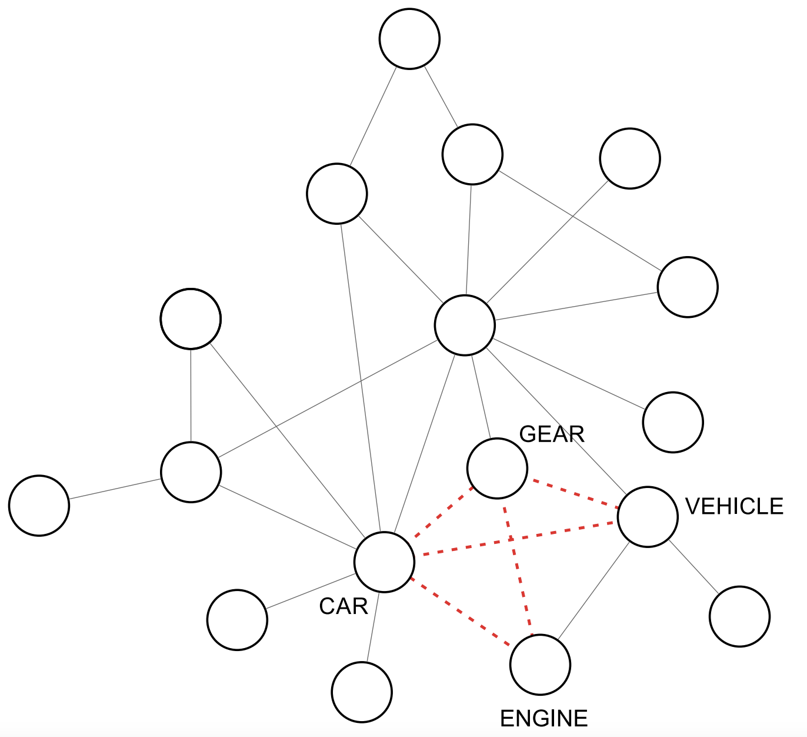

# AuthorshipClassification
In this study, I devised a methodology grounded in word co-occurrence networks and word embeddings to facilitate authorship attribution of English literary books through a network-based approach.

## Datasets
For the purpose of authorship classification, I utilized a dataset encompassing 78 English books, with each of the 13 authors contributing 6 books. The selected authors for this study were Hector Hugh, Thomas Hardy, Daniel Defoe, Allan Poe, Bram Stoker, Mark Twain, Charles Dickens, Pelham Grenville, Charles Darwin, Arthur Doyle, George Eliot, Jane Austen, and Joseph Conrad. Below is a table that displays various authors along with their respective books, which were considered for assembling this dataset.

Hector Hugh | Thomas Hardy  | Daniel Defoe | Allan Poe |
|---- | ---- | --- | --- |
| The Toys of Peace  | A Pair of Blue Eyes  | Memoirs of a Cavalier |  The Works of Edgar Allan Poe - V1 
| The Unbearable Bassington   | A Changed Man  | Colonel Jack  |  The Works of Edgar Allan Poe - V2 
|  Beasts and Super-Beasts  | Jude the Obscure  | The Fortunate Mistress |  The Works of Edgar Allan Poe - V3 

Bram Stoker |  Mark Twain  | Charles Dickens | Pelham Grenville |
|---- | ---- | --- | --- |
| The Lady of the Shroud  | Life on the Mississippi |  Oliver Twist |   My Man Jeeves
| The Mystery of the Sea | The Prince and the Pauper | David Copperfield |  The Clicking of Cuthbert 
| The Man | The Innocents Abroad | A Tale of Two Cities  | The Man with Two Left Feet 

## Methodology
The methodology used in this work encompasses the following steps:
- **Network construction**: here texts are mapped into a co-occurrence networks. Some variations exists in the literature, however here I focused in the most usual variation, i.e. the possibility of considering or disregarding stopwords. A network with co-occurrence links is obtained after this step.
- **Network enrichment**: in this step, the network is enriched with virtual edges established via similarity of word
embeddings. After this step, we are given a complete network with weighted links. Virtually, any embedding
technique could be used to gauge the similarity between nodes.
- **Network filtering**: in order to eliminate spurious links included in the last step, the weakest edges are filtered The outcome of this network filtering step is a network with two types of links: co-occurrence and virtual links.
- **Feature extraction**: In this step, topological and dynamical network features are extracted. Here, we do not
discriminate co-occurrence from virtual edges to compute the network metrics.
- **Pattern classification**: once features are extracted from complex networks, they are used in pattern classification methods. This might include supervised, unsupervised and semi-supervised classification. 

## Main results
aa

## References
[Using virtual edges to improve the discriminability of co-occurrence text networks](https://www.sciencedirect.com/science/article/pii/S037843712030707X). LVC Quispe, JAV Tohalino, DR Amancio. Physica A: Statistical Mechanics and its Applications 562, 125344
